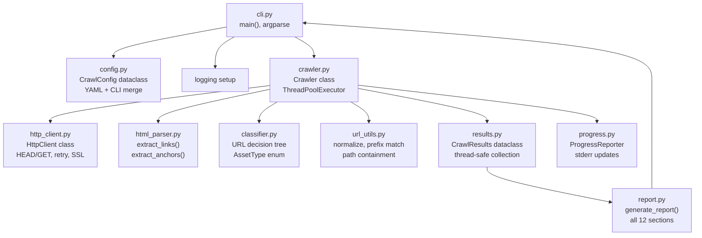

# Implement rms-link-checker

Full implementation of the `link_check` CLI application per [specs/final-spec.md](specs/final-spec.md), using TDD throughout, following [.cursor/rules/python_best_practices.mdc](.cursor/rules/python_best_practices.mdc) and [.cursor/rules/environment_best_practices.mdc](.cursor/rules/environment_best_practices.mdc).

## Current State

The repo is a **scaffold only** -- CI/CD workflows, docs skeleton, `pyproject.toml`, and tooling config exist but contain `TODO` placeholders. There is **no source code under `src/`** and **no test files under `tests/`**. The existing files to preserve and update:

- [pyproject.toml](pyproject.toml) -- replace TODOs, add runtime deps, fix entry point
- [docs/conf.py](docs/conf.py) -- fix `rms-xxx` metadata reference, remove numpy/matplotlib intersphinx
- [docs/index.rst](docs/index.rst) -- rewrite for User's Guide / Developer's Guide structure
- [docs/module.rst](docs/module.rst) -- rewrite for `link_checker` autodoc
- [README.md](README.md) -- replace TODO content, remove SPICE references
- [CONTRIBUTING.md](CONTRIBUTING.md) -- remove `pre-commit` reference, update test commands
- [scripts/run-all-checks.sh](scripts/run-all-checks.sh) -- already updated (pytest --cov -n auto)

---

## Architecture




## Module Inventory

All source under `src/link_checker/`. Every module stays under 1000 lines.


| Module           | Responsibility                                         | Key Public Symbols                                                      |
| ---------------- | ------------------------------------------------------ | ----------------------------------------------------------------------- |
| `__init__.py`    | Package init, `__all__`, version                       | `__version__`                                                           |
| `_version.py`    | Auto-generated by setuptools-scm                       | *(do not edit)*                                                         |
| `py.typed`       | PEP 561 marker                                         | *(empty file)*                                                          |
| `cli.py`         | Entry point, argparse, logging setup                   | `main()`                                                                |
| `config.py`      | Config dataclass, YAML loading, merge                  | `CrawlConfig`, `load_config()`                                          |
| `url_utils.py`   | URL normalization, prefix matching, classification     | `normalize_url()`, `matches_prefix()`, `is_under_root()`, `get_depth()` |
| `classifier.py`  | URL decision tree (spec section 6), asset type enum    | `AssetType`, `classify_asset()`, `UrlDisposition`, `classify_url()`     |
| `http_client.py` | HTTP requests with retry, redirect, SSL, User-Agent    | `HttpClient`, `RequestResult`                                           |
| `html_parser.py` | Link extraction, anchor collection, base href, srcset  | `extract_links()`, `extract_anchors()`, `find_base_href()`              |
| `results.py`     | Thread-safe results aggregation dataclasses            | `CrawlResults`, `BrokenLink`, `RedirectInfo`, etc.                      |
| `crawler.py`     | Main crawl engine, thread pool, work queue, visit-once | `Crawler`, `Crawler.crawl()`                                            |
| `report.py`      | Plain-text report generator for all 12 sections        | `generate_report()`                                                     |
| `progress.py`    | Periodic stderr status updates                         | `ProgressReporter`                                                      |


## Test Inventory

All tests under `tests/`. Each test file maps to a source module.


| Test File             | Tests For        | Mock Strategy                                                |
| --------------------- | ---------------- | ------------------------------------------------------------ |
| `conftest.py`         | Shared fixtures  | Config builders, mock HTML pages, mock HTTP responses        |
| `test_url_utils.py`   | `url_utils.py`   | Pure functions, no mocks needed                              |
| `test_config.py`      | `config.py`      | `tmp_path` for YAML files                                    |
| `test_classifier.py`  | `classifier.py`  | Pure functions + mock config                                 |
| `test_http_client.py` | `http_client.py` | `responses` library to mock `requests`                       |
| `test_html_parser.py` | `html_parser.py` | Inline HTML strings, no mocks                                |
| `test_results.py`     | `results.py`     | Pure dataclass tests                                         |
| `test_crawler.py`     | `crawler.py`     | `responses` for full crawl scenarios                         |
| `test_report.py`      | `report.py`      | Constructed `CrawlResults`, assert exact output strings      |
| `test_cli.py`         | `cli.py`         | `subprocess` or `click.testing`-style via argparse, `capsys` |
| `test_progress.py`    | `progress.py`    | `capsys`/`capfd` for stderr capture                          |


---

## Runtime Dependencies

Add to `[project].dependencies` in [pyproject.toml](pyproject.toml):

```
requests>=2.28.0
beautifulsoup4>=4.12.0
pyyaml>=6.0
```

Add to `[project.optional-dependencies].dev`:

```
responses>=0.23.0
types-requests>=2.28.0
types-beautifulsoup4>=4.12.0
types-PyYAML>=6.0
```

---

## Phase 1: Project Scaffolding

No tests yet -- set up the skeleton so all tooling works.

**1a. Update [pyproject.toml](pyproject.toml):**

- `description`: `"Website crawler, link checker, and content analyzer"`
- `dependencies`: `["requests>=2.28.0", "beautifulsoup4>=4.12.0", "pyyaml>=6.0"]`
- `keywords`: `["link-checker", "crawler", "broken-links", "website"]`
- `classifiers`: Remove astronomy/scientific classifiers. Add `"Topic :: Internet :: WWW/HTTP"`, `"Topic :: Internet :: WWW/HTTP :: Site Management :: Link Checking"`
- `[project.scripts]`: `link_check = "link_checker.cli:main"`
- `[tool.setuptools.package-data]`: `"link_checker" = ["py.typed"]`
- `[tool.setuptools_scm]`: `write_to = "src/link_checker/_version.py"`
- `[[tool.mypy.overrides]]`: module = `"link_checker._version"`
- Add dev deps: `responses>=0.23.0`, `types-requests>=2.28.0`, `types-beautifulsoup4>=4.12.0`, `types-PyYAML>=6.0`
- Remove commented-out TODOs and the second empty mypy overrides block

**1b. Create package skeleton:**

- `src/link_checker/__init__.py` -- import `__version__` from `_version.py` with try/except fallback, declare `__all__`
- `src/link_checker/py.typed` -- empty file
- `src/link_checker/cli.py` -- stub `main()` that returns 0
- `tests/__init__.py` -- empty
- `tests/conftest.py` -- empty for now

**1c. Verify tooling:**

Run `pip install -e ".[dev]"`, then `ruff check src tests`, `ruff format --check src tests`, `mypy src tests`, `pytest -n auto --cov`. All must pass on the stubs.

---

## Phase 2: URL Utilities (TDD)

Pure functions with no I/O -- ideal first TDD target.

**2a. Write `tests/test_url_utils.py` first (RED):**

Test functions covering every spec rule:

- `test_normalize_url_strips_scheme` -- `http://x.com/a` and `https://x.com/a` produce same canonical form
- `test_normalize_url_strips_query_params` -- `https://x.com/a?b=c` becomes `https://x.com/a`
- `test_normalize_url_strips_fragment` -- `https://x.com/a#sec` fragment returned separately
- `test_is_same_domain_exact_match` -- same host returns True
- `test_is_same_domain_subdomain_is_external` -- `sub.x.com` vs `x.com` returns False
- `test_is_same_domain_case_insensitive` -- `X.COM` == `x.com`
- `test_is_under_root_exact` / `test_is_under_root_subpath` / `test_is_under_root_above` / `test_is_under_root_parallel`
- `test_matches_prefix_segment_boundary` -- `dir1/foo` matches, `dir1-foo` does not
- `test_matches_prefix_scheme_insensitive` -- http prefix matches https URL
- `test_get_depth_`* -- various depth calculations
- `test_get_file_extension_`* -- extensions, no extension, trailing slash
- `test_is_html_extension_`* -- `.html`, `.php`, `.asp`, `.cgi`, `.shtml`, `.jpg` (False)
- `test_is_http_url_`* -- `https://`, `http://`, `mailto:`, `tel:`

**2b. Implement `src/link_checker/url_utils.py` (GREEN):**

Key functions (all with full type annotations and docstrings):

- `normalize_url(url: str) -> tuple[str, str | None]` -- returns `(canonical_url, fragment_or_none)`. Canonical = lowercase host, strip scheme to always use `https`, strip query params, strip fragment.
- `is_same_domain(url: str, root_url: str) -> bool` -- compare hosts only (exact match, case-insensitive). Subdomains are different.
- `is_under_root(url_path: str, root_path: str) -> bool` -- path containment with segment boundaries.
- `matches_prefix(candidate_url: str, prefix_url: str) -> bool` -- spec section 5.7 rules. Scheme ignored, host case-insensitive, path segment boundary.
- `get_file_extension(url: str) -> str | None` -- from URL path only.
- `is_html_extension(ext: str | None) -> bool` -- True for `.htm`, `.html`, `.shtml`, `.php`, `.asp`, `.jsp`, `.cgi`, and `None` (no extension).
- `get_depth(url_path: str, root_path: str) -> int` -- directory depth relative to root.
- `is_http_url(url: str) -> bool` -- True for `http://` and `https://` only.

Use `urllib.parse` throughout. Define `HTML_EXTENSIONS` as a module-level `frozenset`.

**2c. Run tests (GREEN), then ruff/mypy.**

---

## Phase 3: Configuration (TDD)

**3a. Write `tests/test_config.py` first (RED):**

- `test_default_config` -- all defaults match spec (timeout=10, retries=3, max_threads=10, etc.)
- `test_load_yaml_all_fields` -- every YAML key parsed correctly
- `test_load_yaml_empty_file` -- returns defaults
- `test_load_yaml_partial` -- unspecified keys use defaults
- `test_cli_overrides_yaml` -- CLI values win
- `test_root_url_from_yaml` / `test_root_url_from_cli` / `test_root_url_missing_raises`
- `test_invalid_yaml_raises` -- malformed YAML
- `test_missing_config_file_raises` -- nonexistent path
- `test_url_lists_parsed` -- asset_urls, no_crawl_urls, ignore_urls
- `test_url_lists_default_empty` -- absent lists become empty lists

**3b. Implement `src/link_checker/config.py` (GREEN):**

```python
@dataclass(frozen=True)
class CrawlConfig:
    root_url: str
    timeout: int = 10
    retries: int = 3
    max_requests: int | None = None
    max_depth: int | None = None
    max_threads: int = 10
    max_referencing_pages: int = 10
    log_level: str = 'INFO'
    output: str | None = None  # None = stdout
    log_file: str | None = None  # None = stderr
    asset_urls: tuple[str, ...] = ()
    no_crawl_urls: tuple[str, ...] = ()
    ignore_urls: tuple[str, ...] = ()
```

- `load_config(cli_namespace: argparse.Namespace, *, config_path: str | None = None) -> CrawlConfig`
- Uses `yaml.safe_load()` for YAML parsing.
- Validates: root_url is present (from CLI or YAML), timeout > 0, retries >= 0, log_level valid.
- Raises `ValueError` with clear messages for invalid config.

---

## Phase 4: Asset Classifier (TDD)

**4a. Write `tests/test_classifier.py` first (RED):**

- `test_classify_asset_image`_* -- `.jpg`, `.png`, `.svg`, `.webp`, `.ico`, etc.
- `test_classify_asset_document`_* -- `.pdf`, `.doc`, `.csv`, etc.
- `test_classify_asset_data`_* -- `.tab`, `.xml`, `.lbl`, `.lblx`, `.img`
- `test_classify_asset_infrastructure`_* -- `.js`, `.css`, `.woff2`, `.json`, etc.
- `test_classify_asset_other` -- `.zip`, `.exe`, unknown extensions
- `test_classify_url_non_http` -- returns NON_HTTP for `mailto:`
- `test_classify_url_ignored` -- matches ignore_urls prefix
- `test_classify_url_no_crawl` -- matches no_crawl_urls prefix
- `test_classify_url_external` -- different domain
- `test_classify_url_internal_in_scope` -- same domain, under root, within depth
- `test_classify_url_beyond_depth` -- exceeds max_depth
- `test_is_misplaced_asset`_* -- all 4 conditions from spec section 8.6

**4b. Implement `src/link_checker/classifier.py` (GREEN):**

- `AssetType` enum: `IMAGE`, `DOCUMENT`, `DATA`, `INFRASTRUCTURE`, `OTHER`
- Module-level dicts mapping extension sets to `AssetType`. Use `frozenset` for each category.
- `classify_asset(extension: str) -> AssetType`
- `UrlDisposition` enum: `NON_HTTP`, `IGNORED`, `ALREADY_VISITED`, `NO_CRAWL`, `EXTERNAL`, `DEPTH_LIMITED`, `INTERNAL_CRAWL`, `INTERNAL_ASSET`
- `classify_url(url, *, config, root_url, root_path, visited_set, depth)` -- implements the spec section 6 decision tree.
- `is_misplaced_asset(url, *, config, root_url, root_path) -> bool` -- spec section 8.6 four conditions.

---

## Phase 5: HTTP Client (TDD)

**5a. Write `tests/test_http_client.py` first (RED):**

Mock all HTTP with the `responses` library.

- `test_head_request_200` -- simple success
- `test_head_405_falls_back_to_get` -- GET fallback
- `test_get_request_returns_body` -- body captured
- `test_timeout_triggers_retry` -- `responses.ConnectionError`, verify retry count
- `test_429_triggers_retry` -- status 429, retried
- `test_503_triggers_retry` -- status 503, retried
- `test_404_not_retried` -- no retry for 404
- `test_retries_exhausted` -- all retries fail, final error recorded
- `test_redirect_chain_recorded` -- 301 -> 302 -> 200, full chain captured
- `test_max_redirects_exceeded` -- 11 redirects, error
- `test_ssl_error_warns_once_per_domain` -- two URLs same domain, one warning
- `test_user_agent_set` -- verify `rms-link-checker/<version>` header
- `test_no_cookies_sent` -- verify no cookie jar behavior
- `test_backoff_uses_timeout_value` -- verify sleep duration between retries (mock `time.sleep`)

**5b. Implement `src/link_checker/http_client.py` (GREEN):**

```python
@dataclass
class RedirectHop:
    url: str
    status_code: int

@dataclass
class RequestResult:
    final_url: str
    status_code: int
    headers: dict[str, str]
    body: str | None  # only for GET
    content_type: str | None
    redirect_chain: list[RedirectHop]
    error: str | None
    bytes_downloaded: int
```

- `HttpClient` class:
  - `__init__(self, *, timeout: int, retries: int, user_agent: str) -> None`
  - Uses `requests.Session()` with `allow_redirects=False` to manually track each redirect hop.
  - `request(self, url: str, *, method: str = 'HEAD') -> RequestResult`
  - Private `_is_transient(status_code_or_exception) -> bool`
  - Private `_do_request(url, method) -> RequestResult` -- single attempt
  - Uses `time.sleep(self._timeout)` for fixed backoff between retries.
  - Tracks SSL-warned domains in a `set[str]` to warn once per domain.
  - Max 10 redirects enforced in the manual redirect loop.
  - No cookies: create a fresh `Session` or clear cookies between requests.

---

## Phase 6: HTML Parser (TDD)

**6a. Write `tests/test_html_parser.py` first (RED):**

- `test_extract_links_a_href` -- `<a href="/page">` extracted
- `test_extract_links_img_src` -- `` extracted as asset
- `test_extract_links_img_srcset` -- multiple URLs in `srcset`
- `test_extract_links_all_elements` -- each element from spec section 7.1 table
- `test_extract_links_relative_resolved` -- `href="page.html"` resolved against page URL
- `test_extract_links_base_href` -- `<base href="https://cdn.example.com/">` changes resolution
- `test_extract_anchors_id` -- `<div id="section1">` collected
- `test_extract_anchors_a_name` -- `<a name="section2">` collected
- `test_extract_anchors_empty_page` -- returns empty set
- `test_find_base_href_present` / `test_find_base_href_absent`
- `test_parse_srcset_single` / `test_parse_srcset_multiple_with_descriptors`
- `test_malformed_html_tolerant` -- unclosed tags, missing attributes

**6b. Implement `src/link_checker/html_parser.py` (GREEN):**

```python
@dataclass(frozen=True)
class ExtractedLink:
    url: str
    source_element: str      # e.g. "a", "img", "script"
    source_attribute: str    # e.g. "href", "src", "srcset"
    is_asset: bool           # True if from asset-only element
```

- `extract_links(html: str, page_url: str, *, base_url: str | None = None) -> list[ExtractedLink]`
  - Uses `BeautifulSoup(html, 'html.parser')`.
  - Iterates through spec section 7.1 element/attribute table.
  - Resolves relative URLs via `urllib.parse.urljoin`.
  - Handles `srcset` by parsing descriptor strings.
- `extract_anchors(html: str) -> frozenset[str]` -- all `id` and `<a name>` values.
- `find_base_href(html: str) -> str | None` -- first `<base href>` in `<head>`.
- `_parse_srcset(value: str) -> list[str]` -- split srcset into individual URLs.

---

## Phase 7: Results and Report (TDD)

**7a. Write `tests/test_results.py` (RED):**

- Test that `CrawlResults` correctly aggregates: `add_broken_link`, `add_redirect`, `add_broken_anchor`, `add_unvalidated_anchor`, `add_non_http_link`, `add_ignore_match`, `add_no_crawl_match`, `add_ssl_warning`, `add_misplaced_asset`, `record_request`.
- Test thread safety: concurrent `add_`* calls from multiple threads produce correct counts.

**7b. Implement `src/link_checker/results.py` (GREEN):**

- `CrawlResults` class with `threading.Lock` for all mutations.
- Dataclasses: `BrokenLink`, `BrokenAnchor`, `UnvalidatedAnchor`, `RedirectInfo`, `Non200Response`, `MisplacedAsset`, `SslWarning`, `NonHttpLink`, `CrawlStatistics`.
- `CrawlStatistics` tracks: start_time, total_requests, bytes_downloaded, per-domain counts, pages crawled, pages checked, external checked.

**7c. Write `tests/test_report.py` (RED):**

- One test per report section (section 10.1 through 10.12).
- Test exact output strings (not substring checks) for small, controlled inputs.
- `test_report_empty_sections` -- verify "(none)" or similar for empty data.
- `test_report_section_headers_have_counts` -- e.g. `"=== Broken Links (3) ==="`.
- `test_referencing_page_truncation` -- >10 pages, verify `"... and N more referencing pages"`.
- `test_statistics_all_domains_listed` -- no "other" bucket.
- `test_ssl_warnings_grouped_by_domain`.

**7d. Implement `src/link_checker/report.py` (GREEN):**

- `generate_report(results: CrawlResults, config: CrawlConfig) -> str`
- One private function per section: `_section_config_summary()`, `_section_statistics()`, `_section_broken_links()`, etc.
- `_format_referencing_pages(pages: list[str], max_pages: int) -> str` -- shared truncation logic.
- All section headers include item counts in parentheses per spec.

---

## Phase 8: Crawler Engine (TDD)

The most complex module. Depends on all previous modules.

**8a. Write `tests/test_crawler.py` (RED):**

Use `responses` to mock entire website topologies as fixtures in `conftest.py`:

- `test_single_page_no_links` -- crawl one page, report clean
- `test_two_pages_linked` -- page A links to page B, both crawled
- `test_external_link_head_checked` -- external link gets HEAD, not crawled
- `test_external_link_head_405_falls_back` -- 405 on HEAD, retried with GET
- `test_broken_link_recorded` -- 404 link appears in results
- `test_redirect_followed_and_recorded` -- 301 redirect chain tracked
- `test_redirect_loop_max_10` -- >10 hops reported as error
- `test_fragment_valid_anchor` -- `#section` exists, no broken anchor
- `test_fragment_missing_anchor` -- `#bad` not found, broken anchor recorded
- `test_fragment_on_already_visited_page` -- anchor checked from cache, no re-fetch
- `test_unvalidated_anchor_on_no_crawl` -- no-crawl page with fragment, warning
- `test_unvalidated_anchor_on_external` -- external with fragment
- `test_unvalidated_anchor_on_depth_limited` -- beyond depth limit with fragment
- `test_visit_once_different_schemes` -- http and https same page, one request
- `test_visit_once_query_params_stripped` -- `?a=1` stripped, one request
- `test_depth_limit_enforced` -- pages beyond depth checked but not crawled
- `test_max_requests_limit` -- stops after N requests
- `test_no_crawl_prefix_checked_not_crawled` -- existence check only
- `test_ignore_prefix_not_checked` -- no request issued, appears in report
- `test_non_http_scheme_logged` -- `mailto:` recorded, no request
- `test_asset_classified_and_checked` -- `.png` gets HEAD check
- `test_misplaced_asset_detected` -- asset outside `asset_urls`, flagged
- `test_misplaced_asset_external_excluded` -- external asset NOT flagged
- `test_misplaced_asset_ignored_excluded` -- ignored asset NOT flagged
- `test_subdomain_treated_as_external` -- `sub.example.com` not crawled
- `test_path_above_root_not_crawled` -- checked but not crawled
- `test_extension_less_non_html_content_error` -- JSON content-type on `/api`, error recorded
- `test_base_href_resolution` -- `<base href>` affects relative link resolution
- `test_concurrent_visit_once` -- two threads find same URL, only one request
- `test_ssl_error_warns_per_domain` -- SSL failure, warning once per domain, crawl continues
- `test_retry_on_429` -- 429 retried, backoff = timeout
- `test_exit_code_0_clean` / `test_exit_code_1_broken` / `test_exit_code_2_fatal`

**8b. Implement `src/link_checker/crawler.py` (GREEN):**

```python
class Crawler:
    def __init__(self, config: CrawlConfig) -> None: ...
    def crawl(self) -> CrawlResults: ...
```

Internal architecture:

- `_visited: set[str]` with `_visited_lock: threading.Lock` -- canonical URLs already processed
- `_queue: queue.Queue[WorkItem]` -- `WorkItem = (url, referrer_url, fragment)`
- `_anchor_registry: dict[str, frozenset[str]]` with lock -- page URL -> anchor IDs
- `_results: CrawlResults` -- thread-safe (internal locking)
- `_request_count: int` with `_request_count_lock: threading.Lock` -- atomic increment, checked against `max_requests`
- `_ssl_warned_domains: set[str]` with lock -- for once-per-domain SSL warnings

Main loop in `crawl()`:

1. Enqueue root URL.
2. `ThreadPoolExecutor(max_workers=config.max_threads)` submits `_process_url` for each work item.
3. `_process_url` implements the spec section 6 decision tree using `classifier.classify_url()`.
4. For internal-crawl URLs: `HttpClient.request(url, method='GET')`, then `html_parser.extract_links()` and `html_parser.extract_anchors()`, then enqueue discovered URLs.
5. For HEAD-check URLs: `HttpClient.request(url, method='HEAD')`, with 405 fallback.
6. After all work drained, return `_results`.

`ProgressReporter` started before the loop, stopped after.

---

## Phase 9: CLI (TDD)

**9a. Write `tests/test_cli.py` (RED):**

- `test_parse_args_root_url_positional`
- `test_parse_args_all_options` -- every flag
- `test_parse_args_defaults` -- verify all defaults
- `test_version_flag` -- prints version and exits
- `test_config_file_loaded` -- YAML file used
- `test_cli_overrides_config` -- CLI wins
- `test_missing_root_url_exits_2` -- no root in CLI or config
- `test_output_to_file` -- report written to `--output` path
- `test_log_file_option` -- log goes to file
- `test_exit_code_propagated` -- 0, 1, 2 from crawl results

**9b. Implement `src/link_checker/cli.py` (GREEN):**

- `main() -> None` -- builds parser, parses args, loads config, sets up logging, runs `Crawler`, generates report, writes output, calls `sys.exit()`.
- `_build_parser() -> argparse.ArgumentParser` -- all options per spec section 3.
- `_setup_logging(log_file: str | None, log_level: str) -> None` -- configures `link_checker` logger.

---

## Phase 10: Progress Reporter (TDD)

**10a. Write `tests/test_progress.py` (RED):**

- `test_progress_emits_to_stderr` -- capfd captures output
- `test_progress_format` -- matches `[Progress] N/~M URLs checked | ...` format
- `test_progress_stop` -- no more output after stop

**10b. Implement `src/link_checker/progress.py` (GREEN):**

- `ProgressReporter` -- uses `threading.Timer` for periodic (5s) stderr writes.
- `update(checked, queued, active_threads, elapsed)` -- formats and writes.
- `start()` / `stop()` -- lifecycle.

---

## Phase 11: Documentation and Packaging

**11a. Update [pyproject.toml](pyproject.toml)** -- all TODOs replaced (done in Phase 1).

**11b. Update [README.md](README.md):**

- Preserve existing header with badges (lines 1-29).
- Replace everything after `<!-- start-after-point -->` with: project description, features list, installation (end-user via `pipx`, developer via clone), quick-start example (`link_check https://example.com`), link to ReadTheDocs.
- Remove SPICE kernel references and mypy editable-install note.

**11c. Update [CONTRIBUTING.md](CONTRIBUTING.md):**

- Remove `pre-commit install` step.
- Update test command to `pytest -n auto --cov`.
- Reference `scripts/run-all-checks.sh`.

**11d. Update [docs/conf.py](docs/conf.py):**

- Fix version: `importlib.metadata.version('rms-link-checker')` (not `rms-xxx`).
- Remove `numpy` and `matplotlib` from `intersphinx_mapping` (not relevant).
- Keep `requests` intersphinx mapping.

**11e. Rewrite [docs/index.rst](docs/index.rst):**

```rst
Welcome to rms-link-checker!
============================

.. include:: ../README.md
   :parser: myst_parser.sphinx_
   :start-after: <!-- start-after-point -->

.. toctree::
   :maxdepth: 2
   :caption: User's Guide:

   user/installation
   user/usage
   user/configuration
   user/report
   user/troubleshooting

.. toctree::
   :maxdepth: 2
   :caption: Developer's Guide:

   dev/setup
   dev/architecture
   dev/api
   dev/testing
   dev/contributing
   dev/releasing

Indices and tables
==================

* :ref:`genindex`
* :ref:`modindex`
* :ref:`search`
```

**11f. Create RST doc files:**

- `docs/user/installation.rst` -- pipx, pip, supported Python versions
- `docs/user/usage.rst` -- CLI synopsis, all options, examples
- `docs/user/configuration.rst` -- YAML format, URL lists, examples
- `docs/user/report.rst` -- each section explained
- `docs/user/troubleshooting.rst` -- common issues
- `docs/dev/setup.rst` -- clone, venv, install dev
- `docs/dev/architecture.rst` -- module overview, data flow, class hierarchy
- `docs/dev/api.rst` -- autodoc for `link_checker` package
- `docs/dev/testing.rst` -- running tests, writing tests, coverage
- `docs/dev/contributing.rst` -- includes `../CONTRIBUTING.md` via MyST
- `docs/dev/releasing.rst` -- tag, release, PyPI publish

Delete [docs/module.rst](docs/module.rst) (replaced by `docs/dev/api.rst`).

**11g. Verify:** `sphinx-build docs/ docs/_build/ -W` -- zero warnings.

---

## Phase 12: Final Verification

- `ruff check src tests` -- zero errors
- `ruff format --check src tests` -- zero differences
- `mypy src tests` -- zero errors
- `pytest -n auto --cov` -- all pass, >= 80% coverage
- `sphinx-build docs/ docs/_build/ -W` -- zero warnings
- `./scripts/run-all-checks.sh` -- all green

---

## Implementation Order Summary

Each phase follows TDD: write failing tests first, then implement, then verify with ruff/mypy/pytest.

1. **Scaffolding** -- pyproject.toml, package skeleton, verify tooling
2. **url_utils** -- pure URL functions (no deps)
3. **config** -- YAML + CLI merge (depends on nothing)
4. **classifier** -- URL decision tree, asset types (depends on url_utils, config)
5. **http_client** -- HTTP wrapper (depends on nothing, mocked in tests)
6. **html_parser** -- HTML parsing (depends on nothing)
7. **results + report** -- data aggregation + formatting (depends on classifier)
8. **crawler** -- main engine (depends on everything above)
9. **cli** -- entry point (depends on config, crawler, report)
10. **progress** -- stderr reporter (depends on nothing)
11. **docs + packaging** -- README, Sphinx, pyproject final polish
12. **final verification** -- all quality gates pass

